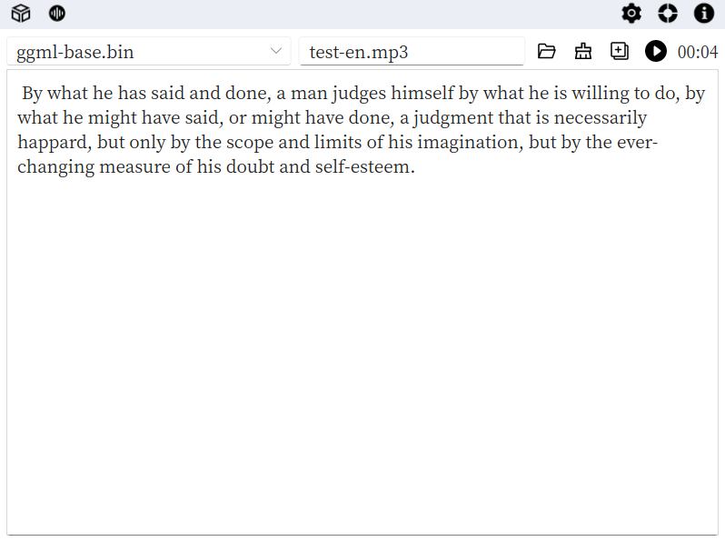

[English Documentation](./README.md)

#### 简介
离线语音转文字工具。使用whisper模型进行转换。

#### 功能
- [x] 支持模型下载
- [x] 支持语音转文字
- [ ] 支持文字转语音

#### 如何构建?
- 安装 `Rust` 和 `Cargo`
- 运行 `make`
- 参考 [Makefile](./Makefile) 了解更多信息

#### 参考
- [Slint Language Documentation](https://slint-ui.com/releases/1.0.0/docs/slint/)
- [github/slint-ui](https://github.com/slint-ui/slint)
- [Viewer for Slint](https://github.com/slint-ui/slint/tree/master/tools/viewer)
- [LSP (Language Server Protocol) Server for Slint](https://github.com/slint-ui/slint/tree/master/tools/lsp)
- [whisper-rs](https://github.com/tazz4843/whisper-rs)
